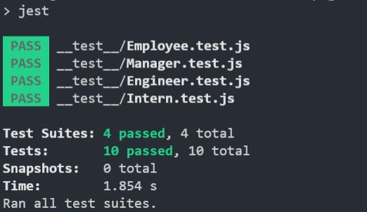
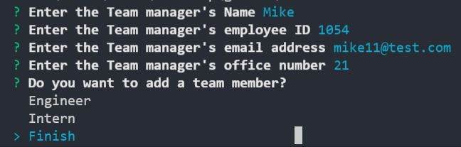
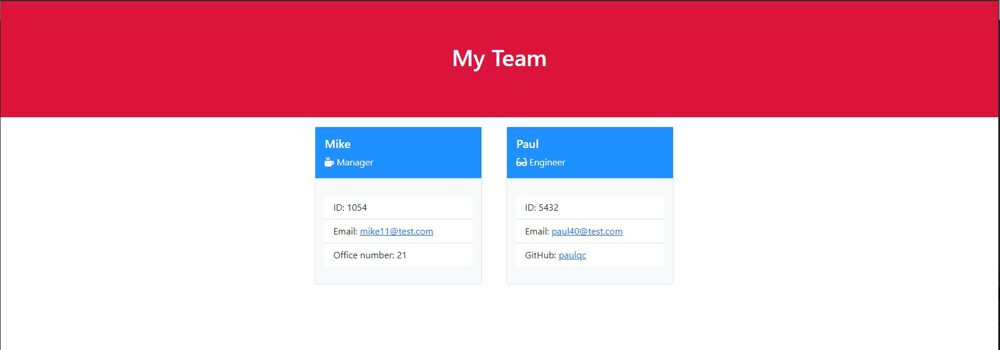

# Team Profile Generator

The purpose of this activity was to get a simple but realistic approach regarding the design of a code. The first part of the program was dedicated to testing so that we were able to see if our approach to the code was working even prior to developing the actual code.

The second part was dedicated to building the program using an object oriented approach. This was achieved by implementing classes that would extend to one another in order to get a final product that had a "DRY" approach.

The third part was built around inquirer with the intent of allowing the user interact with the terminal in order to input data and be able to output a webpage with the user's data.

## Technologies

This project was developed using:
* CSS3
* HTML5
* JavaScript
* Bootstrap
* Node.js
* Inquirer
* Jest

## Setup

To run this project you need to have Node.js installed as well as the dependencies required for this project. Before running the code, make sure you have the required dependencies already installed by running the "npm install" command. Once we are all set up you can run the tests by using the command "npm test" or you can execute the code by running the index.js file with node.

## Results

Once all dependencies are already installed, we can execute the tests that we built for all of our classes by running the command "npm test", once the tests are done we can verify if the logic behind our source file is working as expected.

Once we ran our tests and made sure everything is all right, we can execute the index.js file with node.js which will prompt several questions in the terminal. The end result will always consist of one manager and as many as engineers and interns as the user wants.

To see the file that was built with the Team Profile Generator project, we need to look at the dist folder, there we will find the "index.html" file, we can open said file in our favorite browse and we should be able to see the information we inputted in the terminal displayed in several cards.

|   |    | 
| ------------- | ------------- |
|Jest - Trying out the test files| Inquirer - Interacting with the terminal using the inquirer dependency |

&nbsp;

|   | 
| ------------- |
| Final product - Visualizing the final product in the browser |

&nbsp;

## Walkthrough video
* https://drive.google.com/file/d/13qWSk9VJNHT0fhKhrz715FahfTD85Nd8/view?usp=sharing
